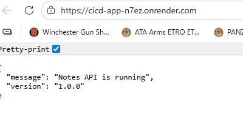
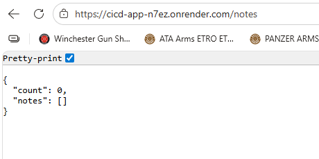
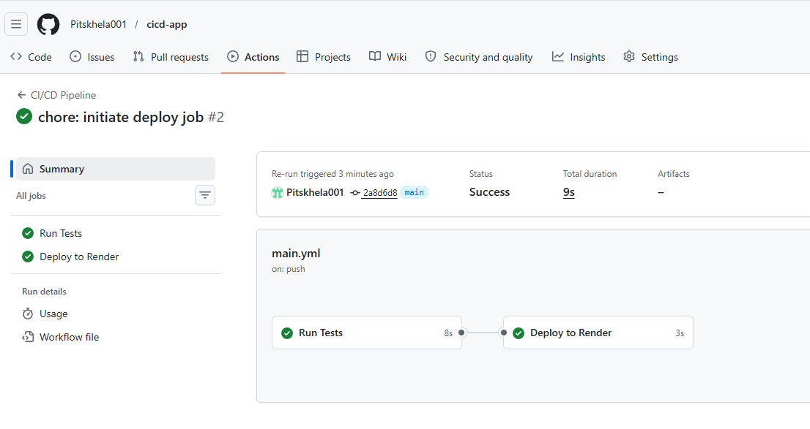
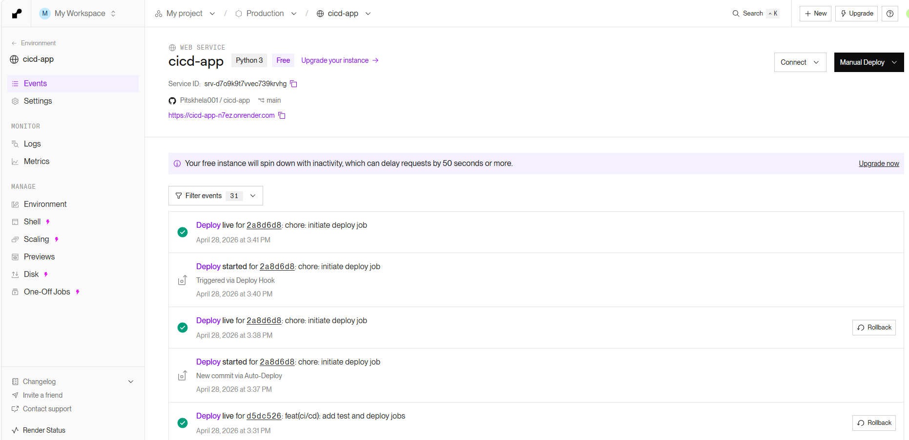

# Notes API — CI/CD Pipeline Assignment

A minimal REST API built with Python and Flask, deployed via a fully automated CI/CD pipeline to Render.

## Live Application

**URL:** https://cicd-app-n7ez.onrender.com

> Note: The app is hosted on Render's free tier. If it hasn't received traffic in a while, the first request may take up to 50 seconds to wake up. Subsequent requests will be fast.

---

## Screenshots

### Hosted Application

**Root endpoint** — API running on Render:




**Health check** endpoint:


**Notes endpoint:**



### Successful GitHub Actions Run

Both CI (Run Tests) and CD (Deploy to Render) jobs passing:



### Render Deploy History

Automatic deploys triggered via Deploy Hook, with Rollback buttons visible:


---

## Pipeline Description

The CI/CD pipeline is defined in `.github/workflows/main.yml` and consists of two jobs.

**Trigger:** Every `push` or `pull_request` to the `main` branch.

**Job 1 — Run Tests (CI stage):**

1. Spins up a fresh Ubuntu virtual machine.
2. Checks out the repository code.
3. Sets up Python 3.11.
4. Installs dependencies from `requirements.txt`.
5. Runs the full PyTest suite (`pytest test_app.py -v`).
6. If any test fails, the pipeline stops completely. The deploy job is never reached.

**Job 2 — Deploy to Render (CD stage):**

1. Only runs if Job 1 passed (`needs: test`).
2. Only runs on direct pushes to `main`, not on pull requests.
3. Sends an HTTP POST request to Render's deploy hook URL (stored as a GitHub Actions secret `RENDER_DEPLOY_HOOK`), which triggers a new deployment on Render.

This enforces a hard quality gate: broken code can never reach production.

---

## Update Strategy — Rolling Update

**Chosen strategy:** Rolling Update

**Why this strategy:** Render's free tier performs rolling updates natively on every deployment. I chose this strategy because it provides zero-downtime deployments without requiring two separate live environments (Blue-Green) or complex traffic splitting configuration (Canary) — both of which require paid infrastructure. Rolling Update is the most practical and honest choice for a free-tier deployment.

**How it works in this project:**

1. A push to `main` triggers the GitHub Actions pipeline.
2. The test job runs all 9 PyTest tests.
3. If tests pass, the deploy job fires the Render deploy hook via HTTP POST.
4. Render pulls the latest commit and installs dependencies.
5. Render starts the new process and waits for it to become healthy (responding on the correct port).
6. Once healthy, Render shifts all traffic to the new process and gracefully terminates the old one.

At no point is the application fully offline — the old version keeps serving traffic until the new version is confirmed healthy.

---

## Rollback Guide

If a bug is discovered in production after a deployment, follow these steps to revert to the previous stable version:

**Option A — Rollback via Render Dashboard (recommended for emergencies):**

1. Log in to [render.com](https://render.com/) and open the `cicd-app` service.
2. Click **Events** in the left sidebar.
3. Find the last known-good deployment in the list.
4. Click the **Rollback** button next to that deployment.
5. Render rebuilds and redeploys that exact commit. The live URL serves the rolled-back version within ~1–2 minutes.

**Option B — Rollback via Git revert (recommended for clean history):**

1. Identify the bad commit: `git log --oneline`
2. Revert it: `git revert <commit-hash>`
3. Push to main: `git push origin main`
4. The CI/CD pipeline runs automatically — tests must pass before the reverted version is deployed.

Option A is faster for production incidents. Option B is preferred when you want the Git history to explicitly reflect the rollback decision.

---

## API Endpoints

|Method|Endpoint|Description|
|---|---|---|
|GET|`/`|API info and version|
|GET|`/health`|Health check|
|GET|`/notes`|List all notes|
|POST|`/notes`|Create a note (`{"content": "..."}`)|
|DELETE|`/notes/<id>`|Delete a note by ID|

---

## Running Locally

```bash
# Create and activate virtual environment
python -m venv venv
venv\Scripts\activate  # Windows
source venv/bin/activate  # Mac/Linux

# Install dependencies
pip install -r requirements.txt

# Run the app
python app.py

# Run tests
pytest test_app.py -v
```